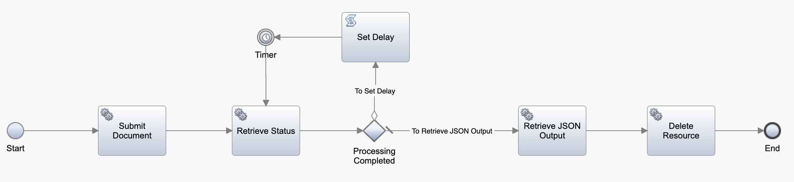

# BAW & ADP Integration Sample
## Overview

This repository provides a sample that shows how you can invoke Automation Document Processing (ADP) from Business Automation Workflow (BAW). This comes in handy in several use cases where you would want to extract structured data from unstructured documents in a Workflow. 

**Note:** This is a sample and is not officially supported by IBM.

## Prerequisites

- A BAW environment (v21.0.3 or above)
- Project ID of your project in the ADP environment
- SSL certficate of the ADP environment imported into the BAW environment

## How it Works

ADP provides serveral [document processing integrations](https://www.ibm.com/docs/en/cloud-paks/cp-biz-automation/21.0.3?topic=processing-developing-document-integrations) that allow you to capture data from your own application. One of the ways is using the [ADP REST API](https://www.ibm.com/docs/en/SSYHZ8_21.0.3/com.ibm.dba.dp/topics/con_ca_api.html). The API returns a JSON output that contains the key-value pairs of the extracted values which can then be used as structured data in BAW. This sample contains a BAW toolkit that invokes this REST API using an External Service with a Java implementation. A pre-defined jar file is included in the toolkit that contains the code to invoke the API. The following ADP operations are exposed as a part of this external service:

- Submit document for processing: This operation triggers the document processing in ADP using the document as an input and provides an analyzer ID in return that be used in further operations.
- Retrieve processing status: This operation uses the analyzer ID from the submit operation and returns the status of processing. If the processing is in progress, the status "InProgress" is returned and if it is completed, the status "Completed" is returned.
- Retrieve JSON output: On successful processing of the document, this operation retrieves the result of the processing in JSON format. This JSON contains both the document classification and the extracted key value pairs.
- Delete resource: This document deletes the resource in ADP and is used to perform cleanup once the document processing is complete.

The token required to authenticate these operations is automatically generated by the code that invokes the API. The toolkit provides Processes, Services Flows and Human Services that allow you to easily invoke these from your Workflow projects

**Capture Document Process**



This Process calls all the required operations to perform and end-to-end document processing and returns the JSON output from ADP that contains the document classification and extracted key value pairs. The Process requires the ADP host info, credentails, project ID, file name, and the file content encoded in base64 format as inputs. As a part of retrieving the document processing status, the Process invokes a timer that checks the status every 15 seconds and this delay can be modified by using the `delay` environment variable. To provide the base64 encoded file content, the toolkit provides two Processes:

1. **Process Document by File Upload**: This Process contains a human service which contains a file upload button. Once a file is uploaded, custom JavaScript extracts the file contents and automatically converts it into a base64 string. If you are curious about how this works, you can look into the `Upload Document` Client-Side Human Service. Once the base64 string is extracted, the Capture Document Process is called to finish the processing in ADP and retrieve the JSON output containing the document classification and extracted key value pairs. 
2. **Process Document by ECM ID**: This Process invokes a service flow that returns the base64 encoded file content of a an ECM document provided the ECM server name and document ID. Once the file contents are retrieved, the Capture Document Process is called to finish the document processing in ADP and retrieve the JSON output containing the document classification and extracted key value pairs.

The following service flows are also available as a part of the toolkit that make it easier to integrate ADP as a part of your Workflows:

1. **Get Document Classification**: This service flow parses the JSON output from ADP and returns the document classification as a string.
2. **Get File Content from ECM Document:** This service flow takes the ECM server name and the document ID and retrieves the file contents encoded as a base64 string.

## How to Use It

1. Import the [ADP Utils](/artifacts/ADP_Utils.twx) Toolkit in your BAW environment. If you are using CP4BA-23.0.X please use this [ADPRESTServices.jar](/artifacts/Version2/ADPRESTServices.jar) in Version2 Folder.
2. Add the toolkit as a dependency to your Workflow project where you want to extract data from a document.
3. Optionally, configure the environment variable `delay` (default of 15 seconds). This value determines how often Workflow will poll ADP to check the completion status of a document submitted for processing.

At this point there are three ways to submit a document for processing:

1. If you already have the file content encoded as a base64 string, you can invoke the **Capture Document** Process.
2. If you want to upload a new file using a human service, invoke the **Process Document by File Upload** Process in your Worklfow. You can modify the human service in the toolkit or duplicate it within your Workflow if you wish to customize the look and feel of the page. 
3. If you want to submit an existing document from your ECM repository, invoke the **Process Document by ECM ID** Process in your Workflow.

In all cases, you will receive a JSON string as an output and this string will contain both the document classification and the extracted key value pairs. To get the classification, you can use the **Get Document Classification** service flow provided as a part of the toolkit. To get the key value pairs, you can parse the JSON to retrieve the property you are looking for. For example, if you are looking for a property `Service address`, you can invoke the following code:

```javascript
var jsonOutput = JSON.parse(tw.local.jsonOutput);
var pageList = jsonOutput.result[0].data.pageList;

mainLoop:
	for (var i=0; i<pageList.length; i++) {
		var kvpTable = pageList[i].KVPTable;
nestedLoop:
		for(var j=0; j<kvpTable.length; j++) {
			if(kvpTable[j].KeyClass == "Service address") {
				tw.local.addressInDocument = kvpTable[j].Value;
				break mainLoop;
			} // end if
		} // end nested for loop
	} // end main for loop

```

​	

